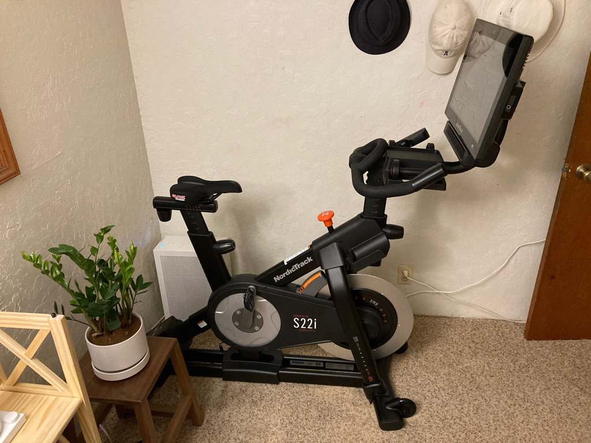

<head>
    <link rel="stylesheet" type="text/css" media="all" href="/style.css">
</head>

[Home](/index.md) / [Exercise](index.md) / Indoor Exercise Equipment

Why am I looking for 

# Cycling

Bowflex C6 Bike $999: It's compact, fairly affordable.

## 20220605

Bottomline: Got the NodricTrack S22i for $470.

Yesterday, I went to see a guy selling his NodricTrack S22i for $500 on Craigslist. Says it was in mint condition. I looked it up online and the price is about $1200 brand new and the reviews were pretty good: one of the best ones out there head-to-head in most categories with the Peloton. There were times when I didn't want to go look at it. Then I thought, "What's to lose?" I even thought that this might be some evil scheme to jump me and steal my cash. I wanted to give Aaron an indoor cycling option. I went there and there it was: a mint-condition S22i. Everything worked. I mentioned that he said on his CL post about being open to a best offer, so he said $475. I countered saying that I had exact change for $470. He said okay. It took some time to get the S22i into the Pathfinder, but we were able to. The thing is heavy. I think about 300 pounds. After some thought I decided that it wouldn't be very good for Aaron: I'm going to have to get him a recumbant indoor cycling system so he feels more secure in the seat. After a long day, I was able to bring the S22 into my small room, install it, and get in a 30-minute cycling exercise to close my exercise ring. I was sweaty so I took a shower and slept pretty well.

# Rower

Water Rower Classic $1495
* Built by hand in the USA
* Solid American black walnut
* Uses water
* Work 84% of muscle mass
* Dolly sheels for upright position for storage

# Cable Machine

Nohrd Slimbeam Cable Machine $2199
* 14 weight plates: 11 - 165 lbs
* Walnut
* Doesn't take up much room
* Pull-up bar