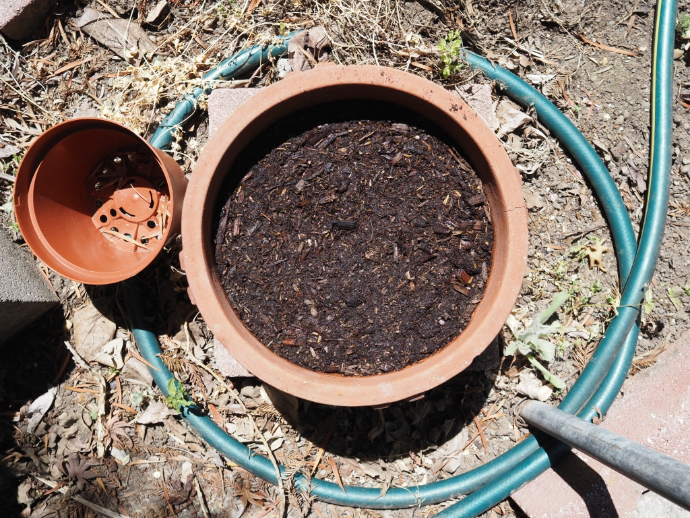

[Gardening](index.md)
# 20220529

Kuroda Carrots
* Temp: ~73F
* Planted them outside in a large planter.
* Seven (7) locations with about 4-5 seeds in each location.
    * Peaceful Valley: Packed for 2021, approx. 500 seeds.
    * Soil Temp.: 45-85F
    * Planting Depth: 1/4-1/2"
    * Germination: 6-20 days
    * Height: 8-10"
    * Maturity: 68-100 days
    * Sun/Shade: Sun
    * Spacing: 2-3"
Mixed:
* Some soil that my sister got for me from Home Depot. Kind of almost mulch-like.
* Added some compost from Lomi, about 80% of the bucket.
* Added a little bit of coffee grounds.
Thoroughly watered. I'd say about half of the watering can. Need to measure more accurately (?)

# 20220530

Went outside to check the soil moisture. The soil seemed only slightly moist so gave it some water. Here's what it says on the Peaceful Valley seed package:
* Soil and Water: Carrots prefer light, deeply tilled soils with plenty of added organic matter, good drainage, a pH range of 6.0-6.6, and regular water. Apply a mulch later once established to keep roots cool.
* Planting and Growing: Seed directly into 75F soil for quick germination. Mix the small seeds with dry coffee grounds or sand to improve seed distribution. Over planting requires thinning to provide sufficient growing room.
* Harvesting and Storage: If necessary, loosen soil to pull carrots without breaking off tops. Trim off foliage to txtend storage time. Layer roots in a container with damp medium and store in cool, moist conditions. Good for canning or freezing.